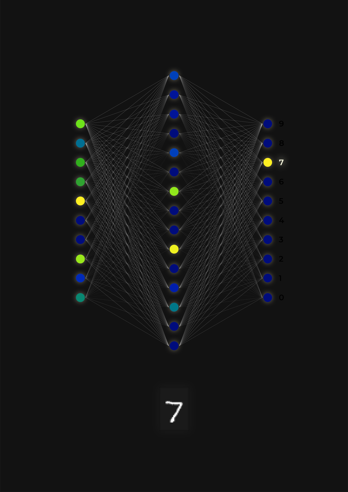

# Physical NN

This is meant to be as much a visualization of a simple artificial neural network as much as it is meant to be an art piece.

I previously did [some work](github.com/yvan674/minimal-mnist) experimenting with making a minimal neural network that could achieve a high accuracy on MNIST. When I visualized the results as a graph with the activation of each neuron being the color of each vertex, it looked quite nice visually so I decided to turn it into a physical visualization.

The final product is a mounted acrylic panel with LEDs lighting up representing the respective activation level of each neuron.

## Acrylic Panel

The main part of the visualization is an acrylic panel with holes cut out for each neuron. Behind each of these holes is a small piece of white acrylic which diffuses the LEDs mounted behind them.

## LEDs and LCD

The visualization runs off of a Raspberry Pi Zero W with software from the [minimal-mnist](github.com/yvan674/minimal-mnist) repo. The LEDs are WS2812B LEDs and the LCD screen is a 3.5 inch Raspberry Pi compatible monitor.

## PCB

To connect all of the components together, a custom PCB was designed that includes the power delivery and all required wiring between the components.
